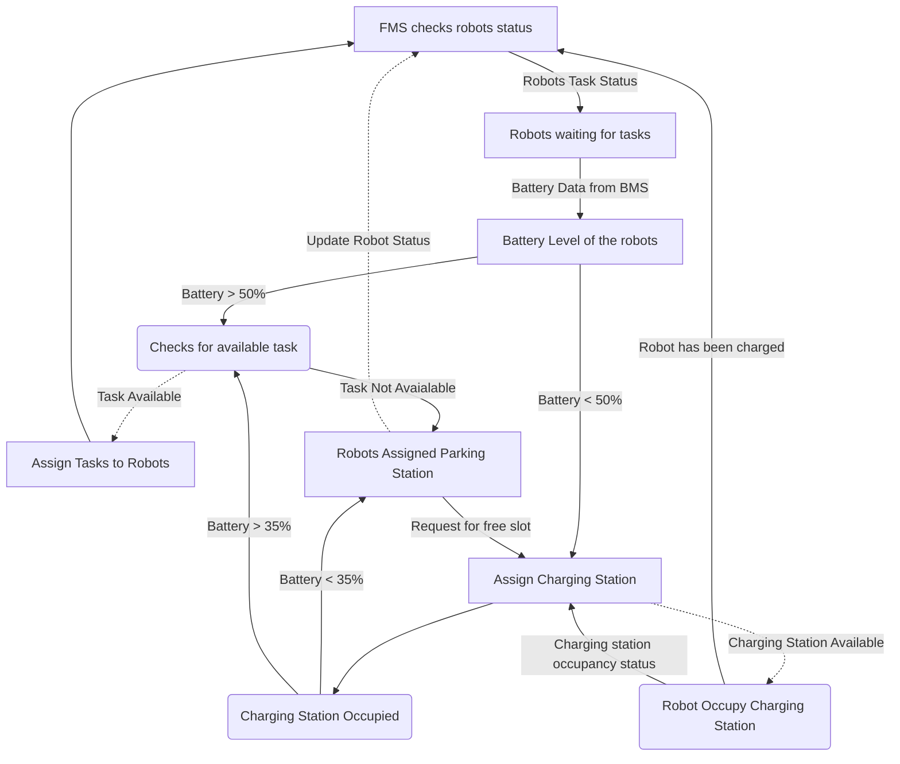

# Technical requirement for the BMS:

## Part of the Battery Managment System
    1.  Battery System
        a.  Battery
        b.  battery drainage
    2.  Charging System
        a.  Charging Station
        b.  Charging Station Assignment
        c.  Queuing System

###  Battery is a aspect of the robot, so it is a part of the robot module.
    *   every robot will be initialised with a initial battery percentage.
    *   The battery will be drained as per the type of motion of the robot.
    *   This is achieved by the [Battery Management System](bms.py).
    
    Here we need a baatery instance to be initialised, whenever a robot is initialised. The battery should be consumed as per the mode of motion of the robot and
    accordingly the battery should be drained. This live data of battery percentage of the robot should be updated, so that the charging system can assign the charging station efficiently.

###  Charging System will be part of the FMS and Simulation Model.
    *   Charging station will be the part of the simulation model, here we have to initialise the charging station and visualise the charging station in the visualizer.
    *   Charging Station assignment will be a part of the FMS, here the charging station will be assigned to the robot on basis of the below parameters:
        *   Robot current task list   
        *   Availability of the charging station
        *   Battery Percentage
        *   Time required for charging the battery upto a extent

